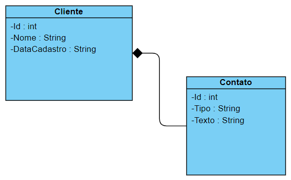

# Desafio React

# Objetivo

> Esse desafio tem por objetivo medir as capacidades técnicas para
> requisitos back-end usando Spring Boot.

# Stack tecnológico

> Spring Boot versões mais recentes.

# Nível

> Básico -- Capacidade de interpretar os requisitos do cliente e
> implementar utilizando Java com o framework Spring Boot.

# Problema

> Criar um projeto Spring Boot para permitir o cadastramento, consulta,
> exclusão, lista, pesquisa e alteração de Clientes, seguindo a seguinte
> modelagem:

{width="4.44536198600175in"
height="2.751890857392826in"}\
**Modelagem Desafio Spring Boot**

**É necessário a utilização dos seguintes itens:**

a)  Ser uma API Restful;

b)  Usar DTO;

c)  Usar Mapper;
